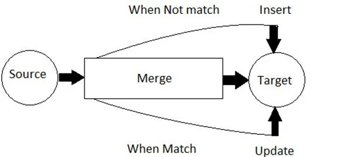
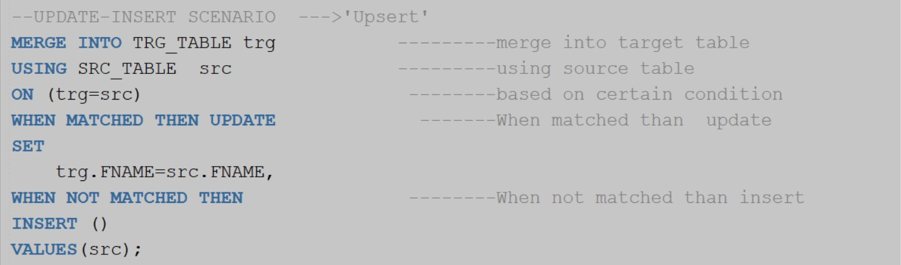

 

## MergeOperation

1. The MERGE statement is used to perform insert, update, or delete operations on a target table based on the results of a join with a source table. 
2. It is often referred to as "upsert" because it can perform an update if a matching record is found, or insert a new record if no match is found

3. MERGE INTO target_table AS target
 |USING source_table AS source |
 |ON condition |
 |WHEN MATCHED THEN |
  |  UPDATE SET column1 = value1, column2 = value2, ... |
 |WHEN NOT MATCHED THEN |
  |  INSERT (column1, column2, ...) |
   | VALUES (value1, value2, ...); |
    
4. target_table: This is the table you want to modify or update based on the data in the source table. 
5. source_table: This is the table providing the data that you want to merge into the target table.
6. condition: This is the join condition that determines how records in the target and source tables are matched. It specifies the criteria for the match.
7. WHEN MATCHED THEN Clause: This is executed when a matching record is found based on the specified condition.You can perform an UPDATE operation on the matched records, setting specific columns to new values.
8. WHEN NOT MATCHED THEN Clause: This is executed when no matching record is found based on the specified condition.You can perform an INSERT operation to add a new record to the target table using values from the source table.